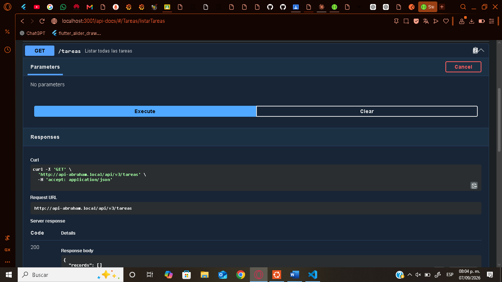
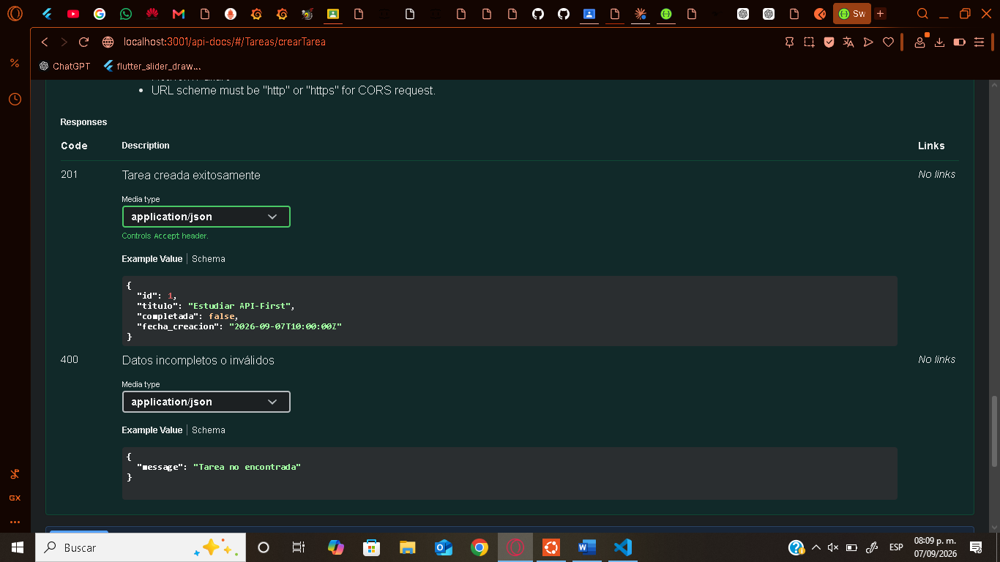
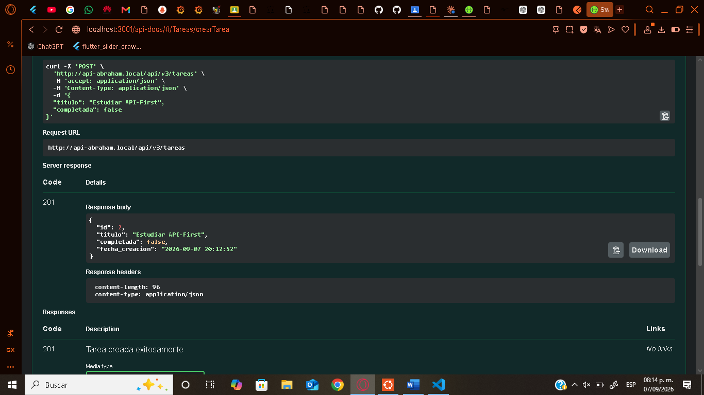
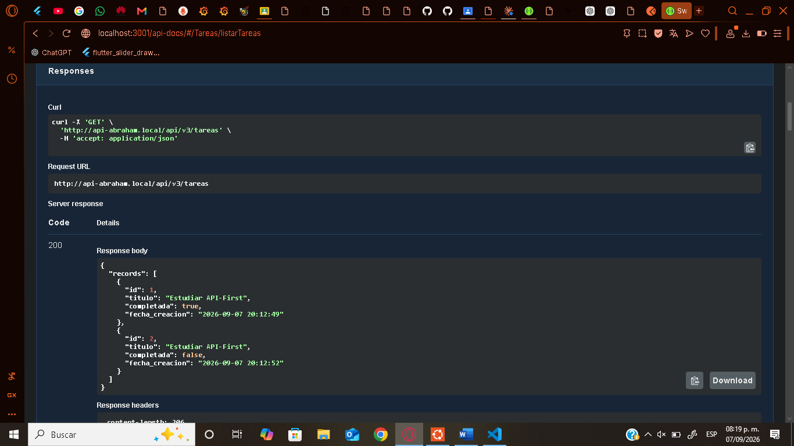
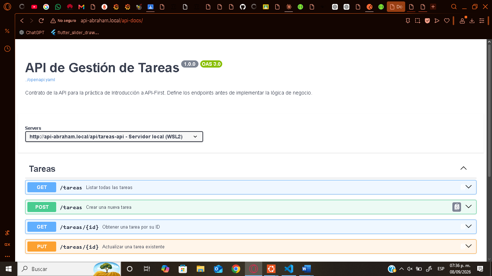
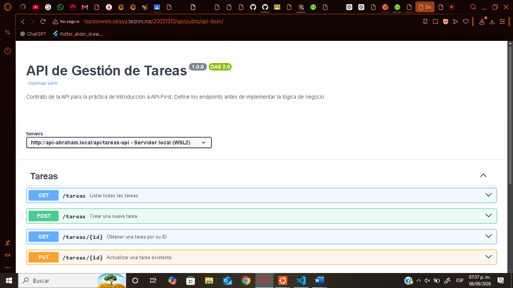
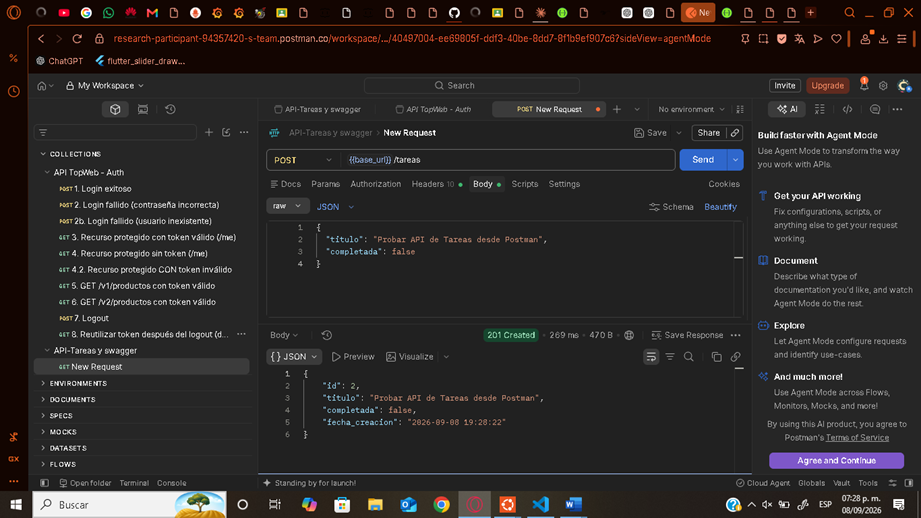
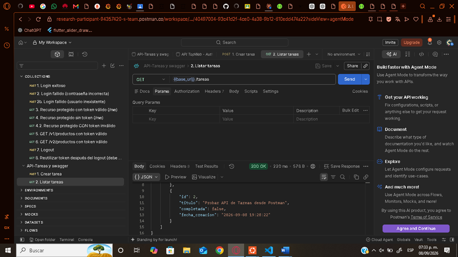

# API de Gestión de Tareas — Práctica API-First

Implementación de la práctica "Introducción a API-First": diseño del contrato (`openapi.yaml`) antes de escribir código, e implementación en PHP puro que cumple ese contrato.

## Estructura del proyecto

```
api/
├── openapi.yaml              # Contrato de la API (diseñado antes del código)
├── config/
│   └── database.php          # Conexión a MariaDB (PDO)
├── core/
│   └── Router.php            # Router simple basado en versiones (v1, v2, v3)
├── models/
│   └── Tarea.php             # Lógica de acceso a datos de la tabla `tareas`
├── resources/
│   └── v3/
│       └── TareaResource.php # Controlador: implementa index, show, store, update
└── public/
    ├── index.php              # Punto de entrada, registra las rutas de /tareas
    ├── openapi.yaml           # Copia del contrato, servida como archivo estático
    └── api-docs/
        └── index.html         # Swagger UI (estático, sin Node.js)
```

## Cómo levantar el proyecto

### 1. Base de datos

Crear la tabla `tareas` en la base de datos existente (`miapp_db`):

```sql
CREATE TABLE tareas (
    id BIGINT UNSIGNED AUTO_INCREMENT PRIMARY KEY,
    titulo VARCHAR(255) NOT NULL,
    completada BOOLEAN NOT NULL DEFAULT FALSE,
    fecha_creacion TIMESTAMP NOT NULL DEFAULT CURRENT_TIMESTAMP
);
```

### 2. Servidor PHP (Apache + WSL2)

El proyecto reutiliza el mismo Virtual Host y base de datos del proyecto de autenticación (`api-abraham.local`). Las rutas de tareas quedan disponibles bajo:

```
http://api-abraham.local/api/v3/tareas
```

No se requiere configuración adicional de Apache si el Virtual Host ya existe — solo agregar los archivos nuevos (`models/Tarea.php`, `resources/v3/TareaResource.php`) y registrar las rutas en `public/index.php`.

### 3. Documentación interactiva (Swagger UI)

Como el proyecto es PHP puro, Swagger UI se sirve como una página estática dentro del propio proyecto (sin depender de Node.js ni npm en el servidor de producción). Apache sirve directamente `public/api-docs/index.html` y `public/openapi.yaml` como archivos estáticos, sin pasar por el router de PHP.

No requiere instalación adicional: los archivos ya están incluidos en el repositorio (`public/api-docs/index.html`, `public/openapi.yaml`), y funcionan en cualquier servidor Apache con solo hacer `git pull`.

Documentación disponible en:
- Local: `http://api-abraham.local/api-docs/`
- Producción: `http://topicosweb.celaya.tecnm.mx/20031313/api/public/api-docs/`

## Endpoints implementados

| Método | Ruta | Descripción |
|---|---|---|
| GET | `/tareas` | Lista todas las tareas |
| GET | `/tareas/{id}` | Obtiene una tarea por su ID |
| POST | `/tareas` | Crea una nueva tarea (`titulo`, `completada`) |
| PUT | `/tareas/{id}` | Actualiza una tarea existente |

## Evidencia: Swagger UI funcionando

**Listado de endpoints y schemas del contrato, cargados desde `openapi.yaml`:**



**Schema del modelo `Tarea` definido en el contrato:**



**Prueba en vivo: `POST /tareas` ejecutado desde Swagger UI contra la API real, respondiendo 201:**



**Confirmación: `GET /tareas` reflejando las tareas creadas y actualizadas:**



**Swagger UI servido de forma estática (sin Node.js) desde el propio proyecto PHP:**



**Swagger UI accesible en el servidor de producción del VPS de la clase:**



## Evidencia: Postman — Crear y listar tareas

Colección incluida: `API-Tareas.postman_collection.json` (importar en Postman; ajustar la variable `base_url` según el entorno a probar).

**`POST /tareas` — Crear tarea (201 Created):**



**`GET /tareas` — Listar tareas (200 OK), incluyendo la tarea recién creada:**



## Despliegue en producción

La API está desplegada y funcionando en el VPS de la clase:

```
http://topicosweb.celaya.tecnm.mx/20031313/api/public/api/v3/tareas
```

Documentación interactiva (Swagger UI) también disponible en producción:

```
http://topicosweb.celaya.tecnm.mx/20031313/api/public/api-docs/
```

Desplegado mediante `git push` (desarrollo local) → `git pull` (servidor), reutilizando la misma base de datos y estructura del proyecto de autenticación ya desplegado previamente. Se creó la tabla `tareas` directamente en la base de datos de producción del VPS, independiente del entorno local de WSL2.
